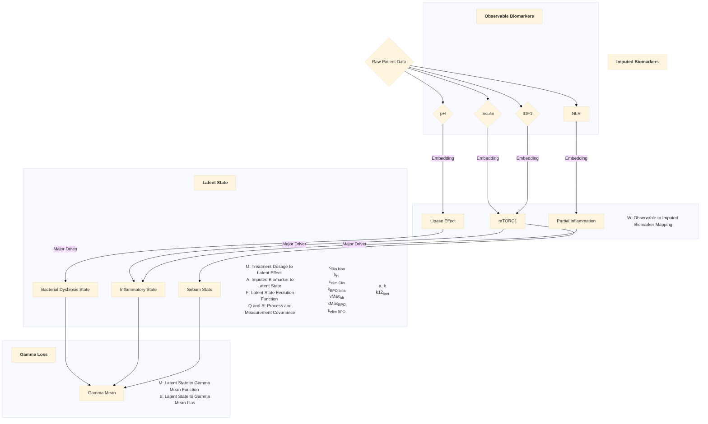

# acneBayesModel (version 2.0.0)
**A patient-specific Python simulation-based optimizer for acne vulgaris treatment regimens.**

## General Information

#### Description:  
AcneBayesModel is a tool for collaborative personalized dermatology. Clinicians may use the software to create dosage schedules from a variety of different treatment options, such as benzaclin, isotretinoin, and others to later be added. 

The software can simulate acne severity improvement under each regimen, allowing clinicians to weigh efficacy against off-target side effects. It does so by maintaining a record of the patient’s latent pathological state. 

Latent Pathological State ($Z{sub}t{/sub}$) is defined thusly, from the following measurable clinical biomarkers:

| Latent State Component  | Description                                                 | Correlated Variables       |
|-------------------------|-------------------------------------------------------------|----------------------------|
| Total Bacterial Dysbiosis| Shift in distribution of facial bacterial microbiome.       | Skin pH                    |
| Total Inflammation      | Inflammatory activity accrued from treatment and pathology. | NLR, [IGF1], [Insulin]                           |
| Total Abnormal Sebum    | Excess sebum produced as a result of pathology.             | [IGF1], [Insulin], skin pH |

Clinicians may make population level treatment recommendations by running simulations with respect to the latest population level model parameters. 

Otherwise, clinicians may train the model with an individual patient's data and hypothesized initial latent state to make individualized treatment regimens for patients. 
They may also display to patients how dietary changes may accelerate time to recovery (in progress).

#### Organization

User Interface build is currently in progress. 

The pipeline/embedding from patient dataframe to acne severity distribution (Gamma distribution indexed by model parameters) is displayed below.  

## Installation
User Interface build is currently in progress. The existing virtual environment uses Python 3.12.9, JAX 

## Usage
User Interface build is currently in progress.

## Applications

1. **Population-Level & Individualized Treatment Recommendation:**
  - Identifies when further treatment is likely to have minimal benefit.
  - Clinicians may make population level treatment recommendations by running simulations with respect to the latest population level model parameters. 
  - Clinicians may train the model with an individual patient's data/hypothesized initial latent state to make individualized recommendations. 
2. **Increasing Motivation to Adhere to Healthy Eating Habits:** 
  - Doctors may run simulations predicting how dietary changes may accelerate time to recovery (in progress).
3. **Scalable Cohort Insight Generation:**
   - Enables dataset analysis and patient report generation.
   - Can be used to summarize time to recovery trends across patient cohorts to guide treatment strategies. 

## Next Steps

1. **Refine Embedding from Raw Data to Observable Biomarker space:**
  -  Refining methods for determining bacterial dysbioses in particular from observable biomarker data.  

2. **Refine Patient-Specific Effect Dependence:**
  - Reintegrating patient-specific PPGR (post-prandial glycemic response) into model structure, instead of as simple prediction bias.

3. **LLM Integration:**
  - Integrate LLM tools to automate report generation for patients and clinicians.

**Author:** Nathaniel Wolff
**Contact:** [nathanielwolff1818@gmail.com; https://github.com/Nathaniel-Wolff]  
**Status:** 8th draft complete, Second UI Build in progress. 
**Date Updated:** 04-28-2026  

